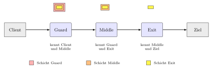
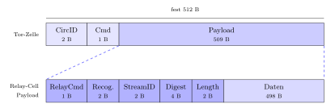
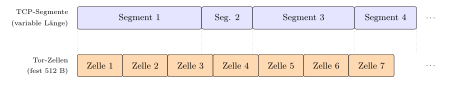
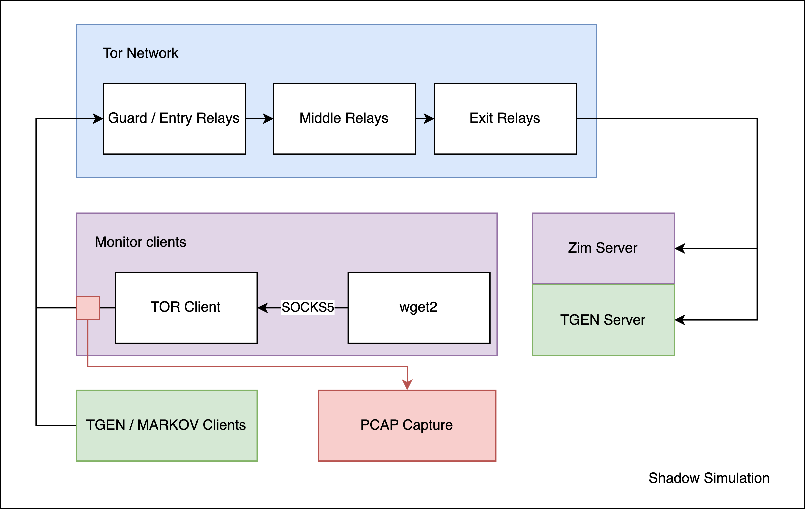
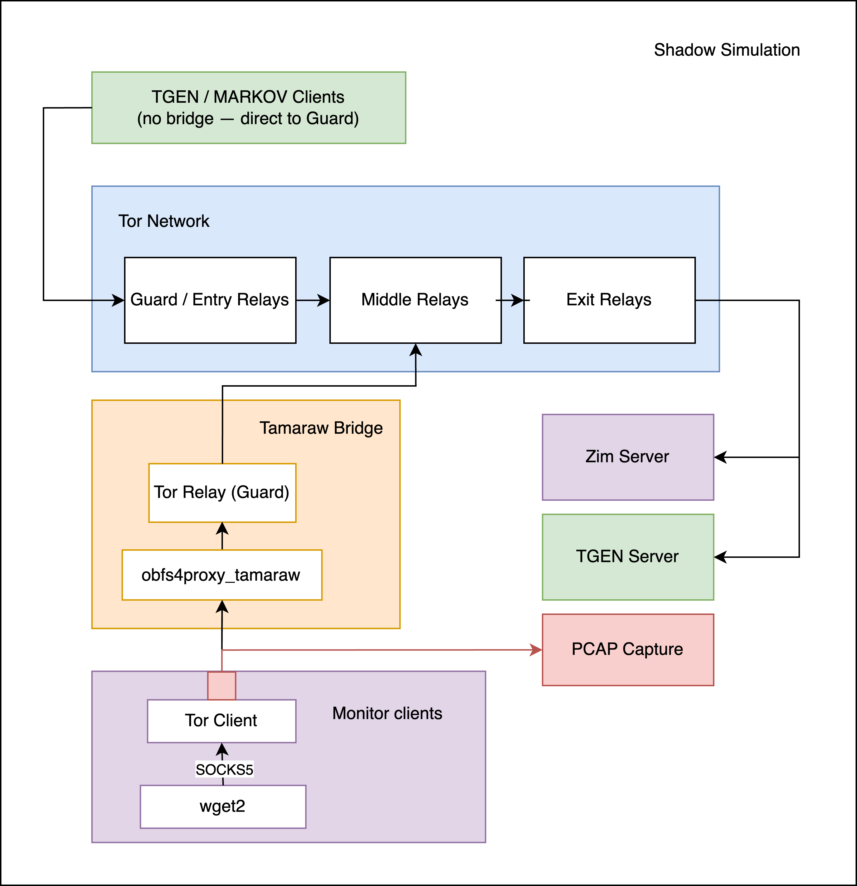
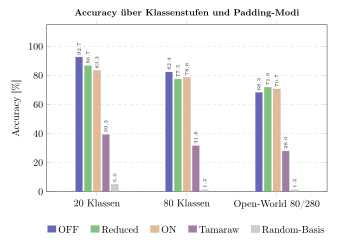
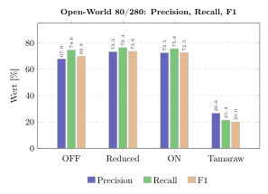
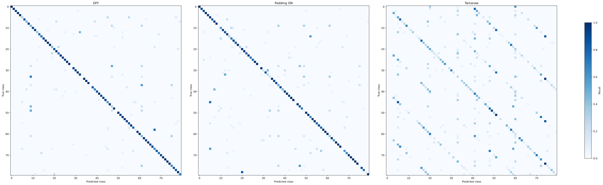
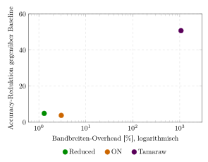
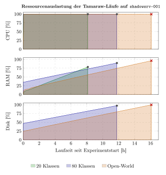

# Schlusspräsentation
Praktische De-Anonymisierung im Tor-Netzwerk: Einfluss von Circuit Padding auf Website-Fingerprinting im Shadow Netzwerk Simulator

Oliver Staub  
Betreuer: Dr. Radwan Eskhita  
Experte: Enrico Senger

HSLU · Bachelorarbeit · Juni 2026

---
hideInToc: true
---

# Agenda

<Toc />

---

# Motivation

<div class="grid grid-cols-2 gap-12 mt-6">

<div>

**Tor verspricht Anonymität** — Millionen Menschen verlassen sich darauf:
- Journalist:innen in autoritären Staaten
- Whistleblower
- Privatsphäre-bewusste Nutzer:innen

</div>

<div>

**Aber:** Verkehrsmuster bleiben sichtbar.

Ein passiver Beobachter zwischen Nutzer und Tor-Guard kann anhand von Paketrichtungen erkennen, **welche Website besucht wurde.**

</div>

</div>

<div class="border-l-4 border-gray-400 pl-4 mt-10">

**Forschungsfrage**

Wie wirksam schützt **Circuit Padding** in einer mit Shadow simulierten Tor-Umgebung gegen einen **Deep-Fingerprinting**-Angriff?

</div>

---

# Tor & Onion Routing



<div class="text-sm opacity-80 mt-8 text-center">
Jede Relais-Schicht kennt nur Vorgänger und Nachfolger. Kein einzelnes Relais sieht Quelle und Ziel zugleich.
</div>

<div class="text-xs text-gray-500 mt-2 text-right">Eigene Darstellung (Bachelorarbeit, Kap. 2)</div>

---
hideInToc: true
---

# Feste Zellengrösse als Angriffsfläche

<div class="grid grid-cols-2 gap-6 mt-15">

<div>



<div class="text-xs text-gray-500 mt-1 text-center">Aufbau einer Tor-Zelle</div>

</div>

<div>



<div class="text-xs text-gray-500 mt-1 text-center">TCP-Segmente vs. feste Tor-Zellen</div>

</div>

</div>

<div class="text-sm opacity-80 mt-4 text-center">
Tor sendet Daten in <b>fixen Zellen</b>. Inhalt und Länge sind verschleiert, aber <b>Richtung und Zeitpunkt</b> der Pakete bleiben beobachtbar.
</div>

---
hideInToc: true
---

# Website-Fingerprinting & Circuit Padding

<div class="grid grid-cols-2 gap-8 mt-4">

<div>

**Website-Fingerprinting (WF)**

- Lokaler passiver Angreifer (ISP, WLAN-Betreiber)
- Beobachtet nur verschlüsselten Tor-Traffic
- Klassifiziert das Muster mit Deep Learning

**Deep Fingerprinting (DF)**

- Sirinam et al. 2018, CNN auf Paketrichtungen
- > 98 % Accuracy im Closed-World-Setting

</div>

<div>

**Verteidigung: Circuit Padding**

- In Tor seit Version 0.4.1 verfügbar
- Sendet Dummy-Zellen nach definierten Mustern
- Verschleiert die reale Traffic-Charakteristik
- Geringer Overhead (low-latency-tauglich)

**Vergleich: Tamaraw**

- Aggressive Verteidigung mit konstanter Senderate
- Starker Schutz, aber hoher Bandbreiten-Preis

</div>

</div>

<div class="text-xs text-gray-500 mt-6 text-right">Vgl. Sirinam et al. (2018), Kadianakis et al. (2021), Cai et al. (2014)</div>

---

# Methodik

<div class="grid grid-cols-2 gap-8 mt-4">

<div>

**Simulation: Shadow**

- Diskrete Event-Simulation echter Tor-Software
- Reproduzierbar, kontrollierbar, isoliert
- Skaliertes Tor-Netzwerk via `tornettools` (Scale 0.01)

**Szenarien**

- Closed-World: 20 und 80 Seiten
- Open-World: 80 überwachte Seiten in 280

</div>

<div>

**Datenerhebung**

- `wget2`-Clients besuchen Wikipedia-Seiten über Tor
- pcap-Capture an den Monitor-Hosts
- NEWNYM zwischen Besuchen (Schaltkreis-Isolation)

**Klassifikation: Deep Fingerprinting**

- DF-CNN aus WFlib
- Train / Valid / Test-Split
- Vergleich der Padding-Modi: OFF · Reduced · ON · Tamaraw

</div>

</div>

---
hideInToc: true
---

# Versuchsaufbau im Shadow-Simulator



<div class="text-xs text-gray-500 mt-2 text-right">Eigene Darstellung (Bachelorarbeit, Kap. 5)</div>

---
hideInToc: true
---

# Tamaraw-Variante des Aufbaus



<div class="text-sm opacity-80 mt-2 text-center">
Zusätzlicher Bridge-Knoten (WFDefProxy) zwischen Client und Guard erzeugt das konstante Tamaraw-Padding.
</div>

<div class="text-xs text-gray-500 mt-1 text-right">Eigene Darstellung (Bachelorarbeit, Kap. 5)</div>

---

# Werkzeug: die shadowctl-Pipeline

<div class="text-sm opacity-80 mb-3">
Die Befehle in der Reihenfolge, in der wir sie ausführen, von der Idee bis zur Resultats-CSV:
</div>

```bash
# 1 · Simulation durchführen
python3 shadowctl.py run 
python3 shadowctl.py status
python3 shadowctl.py pull-results

# 2 · WF-Angriff durchführen
python3 pcap_to_npz.py  
python3 dataset_split.py
python3 train.py 
python3 test.py

# 3 · Report schreiben
python3 report.py
```

---
hideInToc: true
---

# Schritt 1 — Experiment definieren & starten

```bash
python3 shadowctl.py run exp-demo \
  --pages 20 --visits 50 --monitors 10 --padding off
```

<div class="text-sm opacity-80 mt-2">
Generiert die Shadow-Konfiguration, fügt Monitor- und Wikipedia-Knoten hinzu, schiebt die Config auf den Server und startet die Simulation.
</div>


<video controls class="mt-6 mx-auto rounded-lg shadow-lg" style="max-height: 300px">
  <source src="./images/videos/01-run.mp4" type="video/mp4" />
</video>


---
hideInToc: true
---

# Schritt 2 — Fortschritt überwachen

```bash
python3 shadowctl.py status --name exp-demo --tail 20
python3 shadowctl.py logs   --name exp-demo -f
```

<div class="text-sm opacity-80 mt-2">
Zeigt, ob die Simulation läuft, abgeschlossen oder fehlgeschlagen ist, samt Fortschritt und fehlgeschlagenen Seitenabrufen.
</div>

<video controls class="mt-6 mx-auto rounded-lg shadow-lg" style="max-height: 300px">
  <source src="./images/videos/02-status.mp4" type="video/mp4" />
</video>


---
hideInToc: true
---

# Schritt 3 — Resultate herunterladen

```bash
python3 shadowctl.py pull-results --name exp-demo
```

<div class="text-sm opacity-80 mt-2">
Holt Monitor-pcaps, <code>schedule.json</code> und Logs vom Server auf den lokalen Rechner.
</div>

<div class="border-2 border-dashed border-gray-400 rounded-lg p-6 text-center text-gray-500 mt-6">
🎥 <b>Clip 3 — <code>pull-results</code></b><br/>
<span class="text-xs">Aufnahme einfügen unter <code>images/videos/03-pull.mp4</code></span>
</div>

<!-- Wenn aufgenommen: obige div ersetzen durch
<video controls class="mt-6 mx-auto rounded-lg shadow-lg" style="max-height: 300px">
  <source src="./images/videos/03-pull.mp4" type="video/mp4" />
</video>
-->

---
layout: two-cols-header
hideInToc: true
---

# Datenformat: von Pcaps zu Richtungssequenzen

::left::


<div class="text-xs text-gray-500 mt-2 col-span-2">Eigene Darstellung (Bachelorarbeit, Kap. 5)</div>

::right::

```txt
Sample 150:  Website-Klasse = 40  (532 Pakete)
Erste 100 Paketrichtungen:
  +1 -1 -1 +1 -1 +1 -1 -1 +1 -1
  +1 -1 +1 -1 +1 -1 +1 +1 -1 -1
  ...
```

<div class="text-xs text-gray-500 mt-2 col-span-2">
+1 = ausgehend, -1 = eingehend, 5000 Werte pro Sample
</div>

---
hideInToc: true
---

# Schritt 4 — pcap → npz & DF trainieren/testen

```bash
cd src/ml && source venv/bin/activate
bash run_df.sh --pcap \
  --schedule   ../simulation/exp-demo/shadow.config.schedule.json \
  --shadow-data ../simulation/exp-demo/results/shadow.data/ \
  --dataset    ExpDemo
```

<div class="text-sm opacity-80 mt-2">
Konvertiert die Pcaps, splittet in Train/Valid/Test und trainiert das DF-Netz (<code>--feature DIR --seq_len 5000 --train_epochs 30</code>), danach Test mit Accuracy, Precision, Recall, F1.
</div>

<div class="border-2 border-dashed border-gray-400 rounded-lg p-6 text-center text-gray-500 mt-4">
🎥 <b>Clip 4 — Training & Test</b><br/>
<span class="text-xs">Aufnahme einfügen unter <code>images/videos/04-ml.mp4</code></span>
</div>

<!-- Wenn aufgenommen: obige div ersetzen durch
<video controls class="mt-4 mx-auto rounded-lg shadow-lg" style="max-height: 260px">
  <source src="./images/videos/04-ml.mp4" type="video/mp4" />
</video>
-->

---
hideInToc: true
---

# Schritt 5 — Report in die ExperimentLogs.csv

```bash
python3 report.py -e exp-demo -d ExpDemo >> ../../ExperimentLogs.csv
```

<table class="text-xs mx-auto mt-3">
  <thead class="border-b-2">
    <tr>
      <th class="px-3 py-1 text-left">Experiment</th>
      <th class="px-3 py-1">Pages</th>
      <th class="px-3 py-1">Padding</th>
      <th class="px-3 py-1">Samples</th>
      <th class="px-3 py-1">Accuracy</th>
      <th class="px-3 py-1">F1</th>
      <th class="px-3 py-1 text-gray-500">Baseline</th>
    </tr>
  </thead>
  <tbody>
    <tr class="opacity-40">
      <td class="px-3 py-1 italic" colspan="7">… leeres Template (nur Kopfzeile) …</td>
    </tr>
    <tr class="bg-green-100">
      <td class="px-3 py-1">exp-demo</td>
      <td class="px-3 py-1 text-center">20</td>
      <td class="px-3 py-1 text-center">OFF</td>
      <td class="px-3 py-1 text-center">1000</td>
      <td class="px-3 py-1 text-center font-bold">92.7%</td>
      <td class="px-3 py-1 text-center">92.7%</td>
      <td class="px-3 py-1 text-center text-gray-500">5.0%</td>
    </tr>
  </tbody>
</table>

<div class="text-xs opacity-70 mt-2 text-center">
Die vollständige CSV hat 32 Spalten (Netzwerk, Stichprobe, Metriken). Vorlage: <code>ExperimentLogs.template.csv</code>
</div>

<div class="border-2 border-dashed border-gray-400 rounded-lg p-4 text-center text-gray-500 mt-3">
🎥 <b>Clip 5 — neue Zeile erscheint in der CSV</b> · <span class="text-xs"><code>images/videos/05-report.mp4</code></span>
</div>

<!-- Wenn aufgenommen: obige div ersetzen durch
<video controls class="mt-3 mx-auto rounded-lg shadow-lg" style="max-height: 220px">
  <source src="./images/videos/05-report.mp4" type="video/mp4" />
</video>
-->

---

# Resultate

<div class="text-sm opacity-70 -mt-2 mb-1">Accuracy über Klassenstufen und Padding-Modi</div>



<div class="text-xs text-gray-500 mt-1 text-right">Eigene Darstellung (Bachelorarbeit, Kap. 6)</div>

---
hideInToc: true
---

# Effekt von Circuit Padding (Closed-World)

<table class="text-sm mx-auto mt-6">
  <thead class="border-b-2">
    <tr>
      <th class="px-5 py-2 text-left">Padding-Modus</th>
      <th class="px-5 py-2">20 Klassen</th>
      <th class="px-5 py-2">80 Klassen</th>
    </tr>
  </thead>
  <tbody>
    <tr>
      <td class="px-5 py-2 font-semibold">OFF</td>
      <td class="px-5 py-2 text-center bg-red-100 font-bold">92.7%</td>
      <td class="px-5 py-2 text-center bg-red-100 font-bold">82.4%</td>
    </tr>
    <tr>
      <td class="px-5 py-2 font-semibold">Reduced</td>
      <td class="px-5 py-2 text-center bg-yellow-100">86.7%</td>
      <td class="px-5 py-2 text-center bg-yellow-100">77.5%</td>
    </tr>
    <tr>
      <td class="px-5 py-2 font-semibold">ON</td>
      <td class="px-5 py-2 text-center bg-green-100 font-bold">83.3%</td>
      <td class="px-5 py-2 text-center bg-green-100 font-bold">78.6%</td>
    </tr>
    <tr class="border-t">
      <td class="px-5 py-2 text-gray-500">Δ OFF → ON</td>
      <td class="px-5 py-2 text-center text-gray-600">−9.4 pp</td>
      <td class="px-5 py-2 text-center text-gray-600">−3.8 pp</td>
    </tr>
  </tbody>
</table>

<div class="text-sm opacity-80 mt-6 text-center">
Circuit Padding senkt die Accuracy spürbar, aber moderat. Der Effekt schrumpft mit steigender Klassenanzahl.
</div>

---
hideInToc: true
---

# Open-World (80 überwacht in 280)



<div class="text-sm opacity-80 mt-2 text-center">
Im Open-World liegen OFF, Reduced und ON nah beieinander. Die Effektrichtung kehrt sich teils um.
</div>

<div class="text-xs text-gray-500 mt-1 text-right">Eigene Darstellung (Bachelorarbeit, Kap. 6)</div>

---
hideInToc: true
---

# Tamaraw im Vergleich: Konfusionsmatrizen



<div class="text-sm opacity-80 mt-3 text-center">
Unter Circuit Padding (Mitte) bleibt die Diagonale erhalten. Unter Tamaraw (rechts) löst sie sich weitgehend auf.
</div>

<div class="text-xs text-gray-500 mt-1 text-right">Eigene Darstellung (Bachelorarbeit, Kap. 6)</div>

---
hideInToc: true
---

# Kosten-Nutzen-Verhältnis

<div class="grid grid-cols-2 gap-6 mt-2">

<div>



</div>

<div>

<table class="text-sm mt-6">
  <thead class="border-b-2">
    <tr>
      <th class="px-3 py-1 text-left">Modus</th>
      <th class="px-3 py-1">Overhead</th>
      <th class="px-3 py-1">Δ Accuracy</th>
    </tr>
  </thead>
  <tbody>
    <tr><td class="px-3 py-1">Reduced</td><td class="px-3 py-1 text-center">+1.3%</td><td class="px-3 py-1 text-center">−4.9 pp</td></tr>
    <tr><td class="px-3 py-1">ON</td><td class="px-3 py-1 text-center">+3.0%</td><td class="px-3 py-1 text-center">−3.8 pp</td></tr>
    <tr><td class="px-3 py-1">Tamaraw</td><td class="px-3 py-1 text-center">+1063%</td><td class="px-3 py-1 text-center">−50.8 pp</td></tr>
  </tbody>
</table>

<div class="text-sm opacity-80 mt-4">
Circuit Padding: geringe Kosten, moderater Schutz. Tamaraw: starker Schutz, aber überproportionaler Bandbreitenaufschlag.
</div>

</div>

</div>

<div class="text-xs text-gray-500 mt-2 text-right">Eigene Darstellung (Bachelorarbeit, Kap. 6)</div>

---
hideInToc: true
---

# Ressourcen während der Simulation



<div class="text-xs text-gray-500 mt-1 text-right">Eigene Darstellung (Bachelorarbeit, Kap. 6)</div>

---

# Fazit

<div class="grid grid-cols-2 gap-8 mt-6">

<div>

**Kernergebnisse**

- DF erreicht im Closed-World hohe Accuracy (92.7 % bei 20 Klassen)
- Circuit Padding senkt die Accuracy moderat (−9.4 pp bzw. −3.8 pp) bei minimalem Overhead
- Tamaraw schützt deutlich stärker, kostet aber das ~11-Fache an Bandbreite
- Open-World ist klar schwieriger als Closed-World

</div>

<div>

**Beitrag der Arbeit**

- Reproduzierbare WF-Pipeline im Shadow-Simulator
- `shadowctl` automatisiert den gesamten Ablauf bis zur Ergebnis-CSV
- Quantitativer Vergleich der Padding-Modi unter kontrollierten Bedingungen

</div>

</div>

---
hideInToc: true
---

# Limitationen

<div class="grid grid-cols-2 gap-8 mt-6">

<div>

**Aufbau**

- Pro Konfiguration nur ein Lauf mit festem Seed
- Netzwerk-Scale 0.01 (verkleinertes Tor-Netz)
- Homogener Korpus (Simple-English-Wikipedia)

</div>

<div>

**Geltungsbereich**

- Closed-World ≠ Real-World (Single-Tab, nur Wikipedia)
- Simulation statt Live-Tor-Netzwerk
- Knappe Stichprobe pro Klasse (150 Visits)

</div>

</div>

<div class="text-sm opacity-80 mt-8 text-center">
Die Resultate gelten unter Laborbedingungen und sind nicht direkt auf das produktive Tor-Netz übertragbar.
</div>

---
hideInToc: true
---

# Ausblick

<div class="grid grid-cols-2 gap-8 mt-6">

<div>

**Robustere Messung**

- Mehrere Seeds pro Konfiguration
- Grössere Netzwerk-Scale
- Heterogenerer, realistischerer Web-Korpus

</div>

<div>

**Erweiterte Fragestellungen**

- Erkennung von Tor-Verkehr als vorgelagerter Schritt
- Weitere Verteidigungen und Padding-Maschinen
- Mehr Klassen im Open-World-Setting

</div>

</div>

---
layout: cover
hideInToc: true
---

# Vielen Dank

Fragen ?
